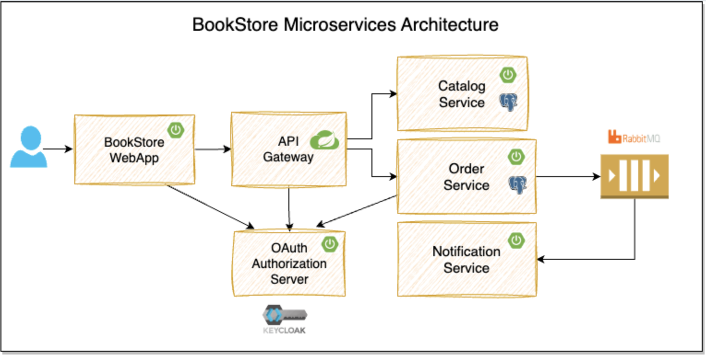

# book-store-ms
Book Store Microservices



## Local Development Setup

-   Install Java 25 or later
  - Install Docker Desktop
  - Install Taskfile utility
  - install Postman or any Rest client

Verify the prerequisites by running the following command:

```bash
$ java -version
$ docker info
$ docker compose version
$ task --version
```

## Some apis

create an order

```bash
curl -X POST http://localhost:8080/api/orders \
-H "Content-Type: application/json" \
-d '{
    "customer": {
        "name": "andres",
        "email": "amerida@gmail.com",
        "phone": "591-79724557"
    },
    "deliveryAddress": {
        "addressLine1": "Pasaje Mexico",
        "addressLine2": "",
        "city": "Sacaba",
        "state": "Cochabamba",
        "zipCode": "50002",
        "country": "Bolivia"
    },
    "items": [
        {
            "code": "P100",
            "name": "Product 1",
            "price": 25.50,
            "quantity": 1
        }
    ]
}'

    
